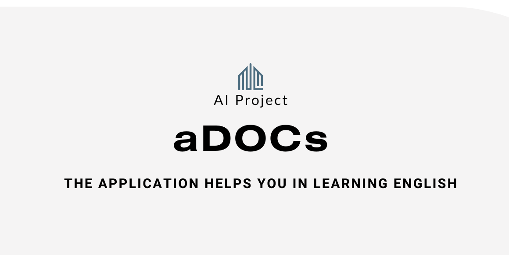
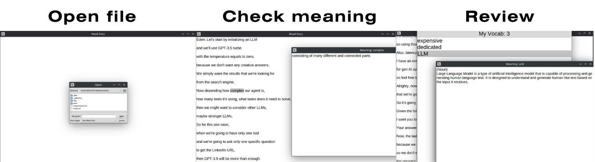

<div align="center">
  <p>
    <a href="https://yolovision.ultralytics.com/" target="_blank">
      </a>
  </p>

<br>

This is the application helps you note the new words when you reading. And it very helpful to learning the english. This app using AI to translate the word based on the content of the text. Try to using it you can see the interesting on it.

</div>


## <div align="center">Usage source code</div>
 - Setup apikey after run this code: 
    + .env files
      ```.env
      OPENAI_API_KEY = your api key
      ```
- Run app: 

  ```bash
  pip install -r requirements.txt
  ```
  ```bash
  python app.py
  ```


## <div align="center">How to use </div>

- **Shortcut**
  + **Ctrl + X :** Exit application 
  + **Ctrl + O :** Open directory to choose file .txt
  + **V :** Translate in vietnamese
  + **E :** Translate in english
  + **N :** Show on your vocabulary

- **Working on your vocabulary**
  + **Left click:** Check meaning of words
  + **Q :** Close the window show
- **Usage**:
  + **Step 1:** Select the word
  + **Step 2:**  Press E/V to check meaning of words
